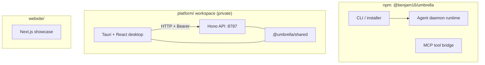

# Umbrella ☂️

[](https://github.com/Benjam16/Umbrella/actions/workflows/ci.yml)
[](https://www.npmjs.com/package/@benjam16/umbrella)
[](./LICENSE)
[](https://nodejs.org/)

**Repository:** [github.com/Benjam16/Umbrella](https://github.com/Benjam16/Umbrella) · **Published CLI:** [`@benjam16/umbrella`](https://www.npmjs.com/package/@benjam16/umbrella)

Umbrella is a **monorepo** that hosts (1) an installable **CLI and long-running agent daemon** with planner → executor → memory, MCP, and optional chat bridges, (2) a **Sovereign Agentic Workstation** desktop + API stack under [`platform/`](./platform), and (3) a **Next.js marketing / showcase** site under [`website/`](./website) (Bento + simulated runner + Edge health demo). This README is the main entry for contributors and users browsing GitHub; deeper references are linked throughout.

---

## Table of contents

- [Choose your path](#choose-your-path)
- [Documentation index](#documentation-index)
- [Architecture at a glance](#architecture-at-a-glance)
- [CLI package](#cli-package)
- [Agent daemon (detailed)](#agent-daemon)
- [Run in Docker](#run-in-docker)
- [Platform workstation (preview)](#platform-workstation-preview)
- [Marketing site](#marketing-site)
- [Repository layout](#repository-layout)
- [Contributing, security, and license](#contributing-security-and-license)

---

## Choose your path

| I want to… | Start here |
|------------|------------|
| **Use the published CLI** (skills, installer, `umbrella up`) | [CLI package](#cli-package) → [`FEATURES.md`](./FEATURES.md) |
| **Run or hack the desktop + API** (DAG runs, backups, blueprints) | [`platform/README.md`](./platform/README.md) + [`CAPABILITIES.md`](./CAPABILITIES.md) |
| **Understand the whole repo** (workflows, CI, releases) | [`REPOSITORY.md`](./REPOSITORY.md) |
| **Deploy the marketing site** | [`website/deploy-vercel.txt`](./website/deploy-vercel.txt) (set Vercel **Root Directory** to `website`) |
| **Report a security issue** | [`SECURITY.md`](./SECURITY.md) |
| **Contribute code** | [`.github/CONTRIBUTING.md`](./.github/CONTRIBUTING.md) |

---

## Documentation index

| Document | What you will find |
|----------|---------------------|
| [`README.md`](./README.md) (this file) | Overview, badges, navigation, CLI install and daemon behavior |
| [`REPOSITORY.md`](./REPOSITORY.md) | Monorepo map, dev commands, npm release notes, CI overview |
| [`CAPABILITIES.md`](./CAPABILITIES.md) | Workstation product story, governance, DR, **API surface summary** |
| [`FEATURES.md`](./FEATURES.md) | CLI marketing-style feature list, automation ideas, deployment angles |
| [`ROADMAP.md`](./ROADMAP.md) | Phased roadmap and next steps for the CLI/agent direction |
| [`platform/README.md`](./platform/README.md) | Platform workspace: API + desktop, env vars, run endpoints |
| [`platform/.env.example`](./platform/.env.example) | Exhaustive API configuration reference (inference, RBAC, backups, etc.) |
| [`SECURITY.md`](./SECURITY.md) | Vulnerability reporting |
| [`.github/CONTRIBUTING.md`](./.github/CONTRIBUTING.md) | PR expectations and local checks |

---

## Architecture at a glance



- **CLI root** (`src/`, `modules/`, `runtime/`, `dist/`): TypeScript package published to npm; see [`package.json`](./package.json) `files` and `bin`.
- **`platform/`**: Not published as a public npm app today; run from source. API defaults to `http://127.0.0.1:8787` unless `PORT` is set.
- **`website/`**: Next.js 15 (App Router) + Tailwind + Framer Motion; deploy on Vercel with Root Directory `website`.

---

## CLI package

**npm:** [`@benjam16/umbrella`](https://www.npmjs.com/package/@benjam16/umbrella)

> **Workstation users:** the **Tauri + Hono** stack lives under [`platform/`](./platform). A concise capability map is in [`CAPABILITIES.md`](./CAPABILITIES.md). The sections below focus on the **CLI / agent daemon** published as `@benjam16/umbrella`.

**One CLI. One agent. Everything done.**

Install once → get slash-command templates for **Claude Code**, **Cursor**, **Gemini CLI**, **OpenAI Codex**-style setups, and other runtimes, plus a 24/7 autonomous agent (planner → executor → memory) with an optional Telegram bridge.

**→ Full marketing / feature list, automation ideas, and standalone deployment notes: [FEATURES.md](./FEATURES.md)**

**→ Showcase site (`website/`):** Next.js Bento + live terminal demo — deploy on [Vercel](https://vercel.com) with **Root Directory = `website`** — see [`website/deploy-vercel.txt`](./website/deploy-vercel.txt).

```bash
npx @benjam16/umbrella@latest
```

The published package name is **`@benjam16/umbrella`**. Maintainer releases: bump version in [`package.json`](./package.json), then from the repo root run `npm publish .` (npm 10.9+ requires the `.` path) or `npm run publish:npm`; see [`REPOSITORY.md`](./REPOSITORY.md#releases-cli-on-npm).

Or from a clone:

```bash
npm install
npm run build
node bin/install.js --claude --local
node dist/src/cli.js install   # same installer via the published entry shape
```

**Appliance-style (global CLI):** `npm install -g @benjam16/umbrella` → `umbrella install --claude` → `umbrella up` (starts the daemon; set keys in `~/.umbrella/.env` or `config.json`). Docker: `docker compose up --build` uses **`GET /api/health`** + **`GET /api/version`** for ops (see `docker-compose.yml` **healthcheck**).

Each install copies **all module skills/commands** plus **bundled references**: `skills/umb-agent-runtime/MCP_TOOLS.md`, `CRYPTO_MCP.md`, and **`examples/`** (including `mcp-crypto.servers.json`) under your Umbrella home (`~/.umbrella` or `./.umbrella`).

### Agent daemon

Requires Node 18+ (uses built-in `fetch` for the planner LLM). **Cursor** does not expose a headless HTTP API for this daemon: point Cursor at the installed `~/.umbrella` skills/commands; the daemon uses Anthropic, OpenAI, or Google cloud APIs above.

```bash
npm run build
# Optional: one LLM key for planner + executor routing (fallback XML plan if none set):
#   Claude → ANTHROPIC_API_KEY
#   OpenAI / Codex → OPENAI_API_KEY
#   Gemini or Gemma (e.g. Gemma 4 on Google AI) → GEMINI_API_KEY or GOOGLE_API_KEY
# Force provider when multiple keys exist: UMBRELLA_LLM_PROVIDER=anthropic|openai|google
# Model id: UMBRELLA_MODEL (defaults: claude-3-5-sonnet-20241022, gpt-4o, gemini-2.0-flash)
ANTHROPIC_API_KEY=sk-ant-... TELEGRAM_BOT_TOKEN=optional npm run agent
```

Or: `node dist/src/cli.js agent start` or **`node dist/src/cli.js up`** (same as `agent start`). **Load order at daemon start:** dotenv files (optional **`UMBRELLA_DOTENV`** path, then **`~/.umbrella/.env`** if present) with **`override: false`** — existing shell variables are not replaced — then optional **`~/.umbrella/config.json`** `{ "env": { … } }` (same merge rule: shell wins). Copy **`examples/.env.example`** and **`examples/config.json.example`**. **`umbrella up --dry-run`** loads `.env` like the daemon, then shows the config merge preview; **`umbrella config-path`** prints the resolved config path.

From a **git clone**, if **`dist/runtime/index.js`** is missing, `umbrella up` / **`umbrella agent start`** run **`npm run build`** once in the package root. Set **`UMBRELLA_NO_AUTO_BUILD=1`** or pass **`--no-build`** to fail fast instead.

**Agent lifecycle:** `umbrella agent stop` / `status` use `~/.umbrella/agent.pid`. Run `umbrella doctor` for a quick environment check.

**Orchestrator (GSD-inspired):** LLM plans use nested **milestones → slices → tasks**; optional budgets via env or `~/.umbrella/orchestrator-context.json`. Repeated failures trigger an **escalation** planning goal (`UMBRELLA_STUCK_THRESHOLD`). Optional `UMBRELLA_VERIFY_COMMAND` and `~/.umbrella/llm-audit.log` for verification and LLM call audit.

**v2 agent controls:** **`UMBRELLA_SUBAGENT_PER_SLICE=1`** — each slice gets a **fresh-context LLM pass** (no memory injection) that expands XML into shell/read/write lines. **`UMBRELLA_SUBAGENT_USE_PROCESS=1`** runs that pass in a **child process** (optional **`UMBRELLA_WORKER_WRAPPER`** executable receiving the job JSON path as its **first argument** (else the built-in `subagent-worker-cli.js` worker is used)); use **`UMBRELLA_WORKER_*`** API keys / **`UMBRELLA_WORKER_CWD`** for isolation; usage is still recorded in the parent as `subagent_slice_worker`. **`UMBRELLA_TOKEN_BUDGET_DAILY`** — approximate token cap per UTC day (`~/.umbrella/token-usage.json`). **`~/.umbrella/session.json`** — heartbeat + checkpoint (`umbrella session reset`). **`UMBRELLA_CHAOS_APPROVE=1`** — human gate before chaos recovery runs shell fixes (pending JSON under `~/.umbrella/chaos-pending/`, approve via **`POST /api/chaos-approve`** on the dashboard or `touch ~/.umbrella/chaos-approved/<nonce>`).

**Anti-fragile / Chaos mode:** shell actions (`shell:`, and raw `git`/`npm`/`node` lines) go through `ChaosMonitor`: on `❌ Shell Error`, the **Chaos Specialist** (LLM + optional DuckDuckGo hint) proposes fix commands, runs them, and retries (up to 3 rounds). Payment-quota style errors can trigger the **X402 stub** (`UMB_X402_ENABLED=1` — implement settlement in `x402.ts`). **Dashboard:** set `UMBRELLA_DASHBOARD_PORT=4578` (for example) and open `http://127.0.0.1:4578/` for a live **chaos feed** (`GET /api/chaos-logs`), **last heartbeat** (`GET /api/last-run`), and **MCP tool hints** (`GET /api/mcp-tools`).

**MCP (stdio servers):** set `UMBRELLA_MCP_ENABLED=1` and `UMBRELLA_MCP_SERVERS` and/or **`UMBRELLA_MCP_SERVERS_FILE`** (JSON array; merged). Env values support **`${VAR}`** expansion from the daemon’s environment. **Crypto / on-chain:** `modules/agent-runtime/tools/CRYPTO_MCP.md` + `examples/mcp-crypto.servers.json`. Executor: `mcp:{"server":0,"name":"tool","arguments":{}}`. See `modules/agent-runtime/tools/README.md`.

**Goals (core vs foreground):** the daemon stores a long-running **core goal** (background progress when idle) and an optional **foreground task** that **interrupts** the core until you clear it or verification succeeds. Telegram: `/umb core …`, `/umb task …`, `/umb done`, `/umb pause` / `/umb resume`, `/umb brief`. HTTP (same `UMBRELLA_INBOUND_SECRET`): `POST /api/core-goal` `{"goal":"…"}`, `POST /api/goal` sets **foreground** (one-off), `POST /api/foreground/clear`, `GET /api/agent-state`, `POST /api/agent-state` with `{"backgroundPaused":true}` etc. Set `UMBRELLA_FOREGROUND_CLEAR_ON_VERIFY=0` to keep foreground until manual clear. **`POST /api/skill-approve`** approves a skill proposal when `UMBRELLA_SKILL_APPROVE=1`.

**Telegram digests:** `UMBRELLA_TELEGRAM_DIGEST_HEARTBEATS=N` sends a short summary to the last chat that used `/umb`, every N heartbeats.

**Import skills:** `node bin/import-skill.js /path/to/skill-folder [alias]` → `~/.umbrella/skills/umb-imported/<alias>/`.

**Ship CLIs:** **`umbrella scaffold cli <dir> @scope/pkg [--bin name]`** copies **`examples/shipping-cli-template`** (TypeScript, Vitest, GitHub Action → **`npm publish --provenance`** on semver tags). Operator guide: **`examples/SHIPPING.md`** (recommended **`UMBRELLA_SHIPPING_ROOT`**, npm Trusted Publishers, no ad-hoc `npm publish` from the agent host).

**Threat model (short):** the daemon can run **shell** and **MCP** tools you enable. Use **`UMBRELLA_SHELL_POLICY=strict`** and **`UMBRELLA_SHELL_ALLOW_PREFIXES`** for write boundaries; **`UMBRELLA_SUBAGENT_USE_PROCESS=1`** (and optionally **`UMBRELLA_WORKER_WRAPPER`**, see **`examples/worker-wrapper.example.sh`**) for isolation; run in **Docker** on shared hosts; keep the dashboard on **localhost** or behind auth; disable **`UMBRELLA_WEB_FETCH`** / **`UMBRELLA_BROWSER_HINT_DISABLED=1`** if outbound hints are unwanted.

### Run in Docker

```bash
docker build -t umbrella .
docker run --rm \
  -e ANTHROPIC_API_KEY=sk-ant-... \
  -e UMBRELLA_DASHBOARD_PORT=4578 \
  -p 4578:4578 \
  -v umbrella_data:/root/.umbrella \
  umbrella
```

Or: `docker compose up --build` (see `docker-compose.yml`). Copy `.env.umbrella.example` to `.env.umbrella` and pass variables with `-e` / compose `environment:` as you prefer.

---

## Platform workstation (preview)

The **`platform/`** directory is an npm workspace (`apps/api`, `apps/desktop`, `packages/shared`) that implements a **local-first workstation**: multi-step runs, credit-metered inference hooks, RBAC, backups and DR endpoints, blueprint gallery, and optional Coinbase/Playwright integrations. It is **not** the same artifact as the npm CLI package.

| Topic | Where to read |
|-------|----------------|
| Run API + desktop | [`platform/README.md`](./platform/README.md) |
| Product + REST map | [`CAPABILITIES.md`](./CAPABILITIES.md) |
| All API env vars | [`platform/.env.example`](./platform/.env.example) |
| Repo-wide developer map | [`REPOSITORY.md`](./REPOSITORY.md) |

Quick commands:

```bash
cd platform && npm install
npm run dev:api      # API (see apps/api/.env)
npm run dev:desktop  # Tauri + Vite (Rust required for full Tauri build)
```

---

## Marketing site

The **`website/`** folder is a **self-contained Next.js** app (`npm run dev` / `npm run build`). Deploy with **Root Directory = `website`** on Vercel. Step-by-step: [`website/deploy-vercel.txt`](./website/deploy-vercel.txt).

---

## Repository layout

| Path | Role |
|------|------|
| [`FEATURES.md`](./FEATURES.md) | CLI-oriented product / capability overview + automation & standalone roadmap |
| [`examples/`](./examples/) | `mcp-crypto.servers.json`, systemd / launchd samples, shipping CLI template |
| [`ROADMAP.md`](./ROADMAP.md) | Milestones and phased next steps |
| [`Dockerfile`](./Dockerfile) / [`docker-compose.yml`](./docker-compose.yml) | Agent in a container with persisted `~/.umbrella` |
| [`bin/install.js`](./bin/install.js) | Copies `modules/*` skills/commands into `~/.umbrella` (or `./.umbrella` with `--local`) |
| [`bin/import-skill.js`](./bin/import-skill.js) | Import a `SKILL.md` folder into `~/.umbrella/skills/umb-imported/` |
| [`modules/agent-runtime/`](./modules/agent-runtime/) | SQLite memory, planner, executor + tool sandbox, Telegram gateway |
| [`runtime/index.ts`](./runtime/index.ts) | Heartbeat loop entry |
| [`.github/workflows/ci.yml`](./.github/workflows/ci.yml) | CI: root CLI + `platform` build and API tests |

---

## Contributing, security, and license

- **Contributing:** [`.github/CONTRIBUTING.md`](./.github/CONTRIBUTING.md)
- **Security:** [`SECURITY.md`](./SECURITY.md)
- **License:** [MIT](./LICENSE)

### Optional: enrich the GitHub “About” box

On the repository home page, click **⚙** next to **About** and consider adding:

- **Description:** e.g. *Umbrella — CLI agent daemon + Sovereign Agentic Workstation (Tauri/Hono); published as `@benjam16/umbrella`.*
- **Website:** your Vercel URL or docs site if you have one.
- **Topics:** e.g. `ai-agent`, `mcp`, `cli`, `typescript`, `tauri`, `hono`, `automation`, `orchestration` (topics are not stored in git; they only appear on GitHub when you set them here).

MIT License — see [`LICENSE`](./LICENSE).
