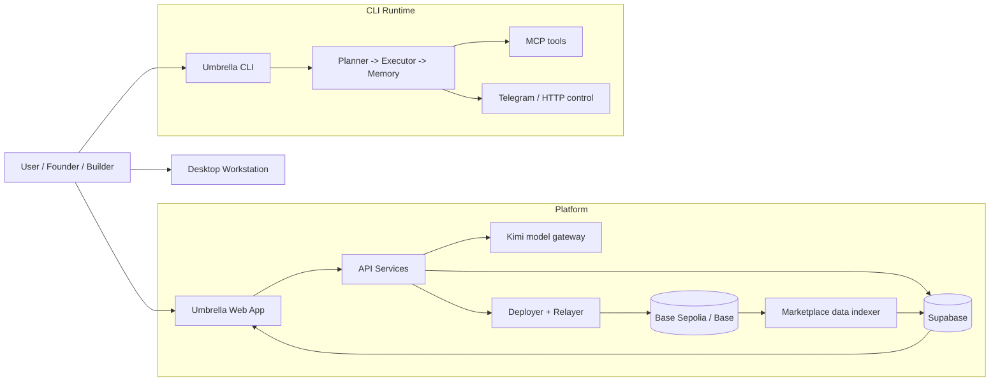
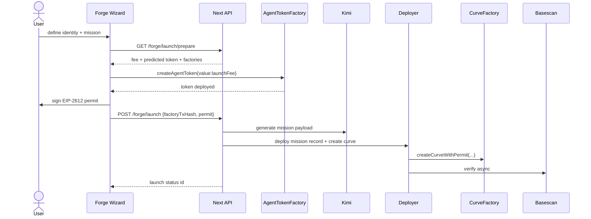
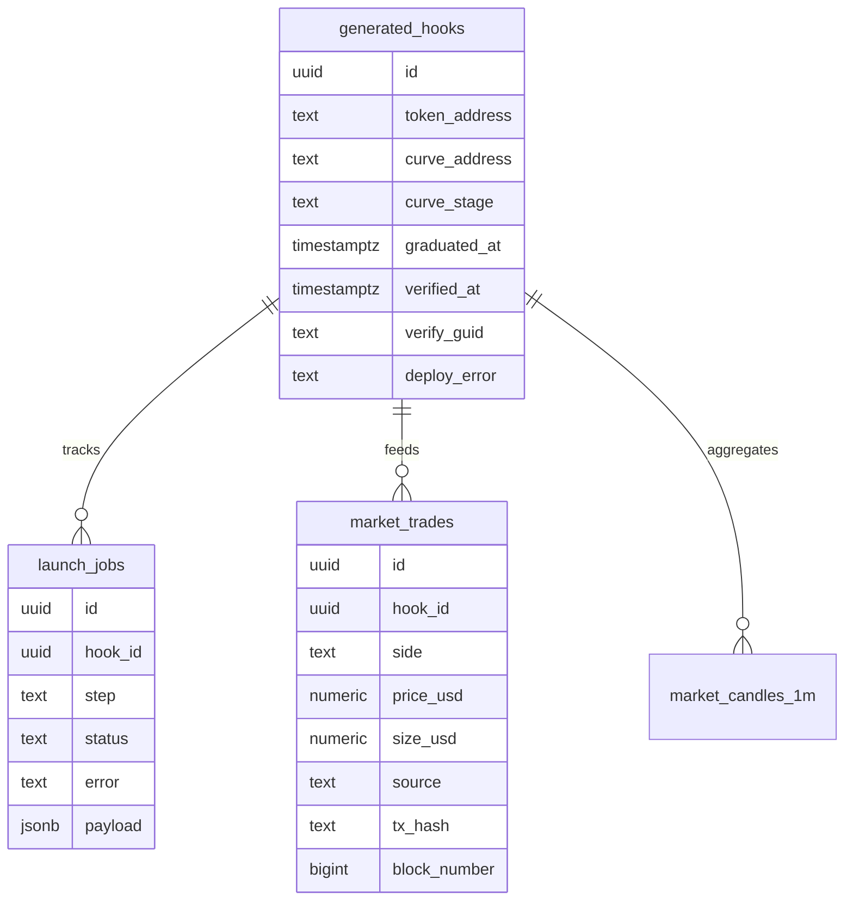

# Umbrella ☂️  
**Smart Agent + Token Platform**

[](https://github.com/Benjam16/Umbrella/actions/workflows/ci.yml)
[](https://www.npmjs.com/package/@benjam16/umbrella)
[](https://nodejs.org/)
[](./LICENSE)
[](https://www.base.org/)
[](https://www.typescriptlang.org/)

Umbrella is a production-oriented monorepo for:

- **CLI + autonomous agent daemon** (`@benjam16/umbrella`)
- **Agent launchpad platform** (web + API + contracts) with pump.fun-style lifecycle
- **Desktop workstation stack** for sovereign operation
- **Marketing/showcase site** for product-facing web presence

**Repository:** [github.com/Benjam16/Umbrella](https://github.com/Benjam16/Umbrella)  
**Published package:** [`@benjam16/umbrella`](https://www.npmjs.com/package/@benjam16/umbrella)

---

## Visual Overview



---

## What Umbrella Delivers

| Area | Capability | Outcome |
|---|---|---|
| Token Launchpad | Single user payment + token deploy + permit + curve deploy | Frictionless launch flow |
| Trading | In-app bonding curve buys/sells + post-graduation pool flow | Native pump.fun-like UX |
| Verification | Async Basescan verification pipeline | Faster launch completion |
| Market Data | Real indexed trades + warm-up from curve reserves | No fake charting fallback |
| Agent Runtime | Long-running CLI daemon with plans/slices/tasks | Autonomous execution |
| Ops + Safety | Relayer auth, status diagnostics, low-balance visibility | Production readiness |

---

## Pump.fun-Style Launch Lifecycle



---

## Platform Architecture (Detailed)

```mermaid
flowchart TB
  subgraph Frontend["apps/web (Next.js)"]
    F1[Home + Marketplace + Forge]
    F2[TradeDrawer + LaunchStatusPanel]
    F3[Settings / System status]
  end

  subgraph API["API Routes / Services"]
    A1[/api/v1/forge/launch*]
    A2[/api/v1/marketplace*]
    A3[/api/v1/system/status]
    A4[launch orchestrator]
    A5[deployer + basescan client]
    A6[market ingest]
  end

  subgraph Data["Supabase"]
    S1[(generated_hooks)]
    S2[(launch_jobs)]
    S3[(market_trades)]
    S4[(market_candles_1m)]
    S5[(market_indexer_state)]
  end

  subgraph Chain["Base / Base Sepolia"]
    C1[UmbrellaAgentTokenFactory]
    C2[UmbrellaCurveFactory]
    C3[UmbrellaBondingCurve]
    C4[MissionRecord contract]
  end

  F1 --> A1
  F1 --> A2
  F3 --> A3
  A1 --> A4 --> A5
  A5 --> C1
  A5 --> C2
  A5 --> C4
  A2 --> A6 --> S3
  A4 --> S1
  A4 --> S2
  A6 --> S4
  A6 --> S5
  C3 --> A6
  S1 --> F1
  S3 --> F2
```

---

## Monorepo Map

| Workspace | Tech | Primary Role |
|---|---|---|
| `platform/apps/web` | Next.js + TypeScript | User-facing app, forge wizard, marketplace, status panels |
| `platform/apps/api` | Node + TS services | Relayer workers, indexers, backend integrations |
| `platform/contracts` | Solidity + Foundry | Token factory, curve, mission record, deploy scripts/tests |
| `platform/apps/desktop` | Tauri + React | Local sovereign workstation UI |
| `modules/agent-runtime` | TS runtime | CLI planner/executor/memory/chaos handling |
| `website` | Next.js | Marketing/showcase deployment target |

---

## Quick Start Paths

### 1) CLI (published package)

```bash
npx @benjam16/umbrella@latest
```

From source:

```bash
npm install
npm run build
node dist/src/cli.js install
node dist/src/cli.js up
```

### 2) Platform (web + api + contracts)

```bash
cd platform
npm install
npm run dev:api
npm run dev:web
```

Contracts:

```bash
cd platform/contracts
forge build
forge test
```

### 3) Docker (agent runtime)

```bash
docker compose up --build
```

---

## Launchpad + Market Features

- **Single-payment launch transaction** inside token factory call.
- **Permit-based curve seeding** using EIP-2612 (no extra approval tx).
- **Real-time launch step tracking** via `launch_jobs` + `LaunchStatusPanel`.
- **In-app curve trading** for active stage (`buy` / `sell` directly on curve).
- **Graduation-aware state** (`pending`, `deploying`, `active`, `graduated`, `failed`).
- **Async explorer verification** so launches are not blocked by explorer delays.
- **Curve-source trade ingest** (`source=curve|pool`) for cleaner analytics.
- **Status diagnostics** including deployer key/balance visibility.

---

## Data Model Highlights



---

## Security + Reliability Model

| Layer | Controls |
|---|---|
| API access | Relayer secret checks on ingestion/update routes |
| Deployment | Dedicated deployer private key, env-gated mainnet |
| Verification | Async Basescan flow with persisted GUID/status |
| Data integrity | Idempotency keys + indexer cursor state |
| Runtime safety | Configurable shell policy, optional process isolation |
| Operations | `/app/settings` system status + deployer low-balance warning |

---

## Environment & Ops References

- Root ops + repo guidance: [`REPOSITORY.md`](./REPOSITORY.md)
- Platform setup: [`platform/README.md`](./platform/README.md)
- Full platform env reference: [`platform/.env.example`](./platform/.env.example)
- Web launch env examples: [`platform/apps/web/.env.example`](./platform/apps/web/.env.example)
- Capabilities summary: [`CAPABILITIES.md`](./CAPABILITIES.md)
- CLI feature depth: [`FEATURES.md`](./FEATURES.md)

---

## Documentation Index

| Document | Scope |
|---|---|
| [`README.md`](./README.md) | High-level architecture + onboarding |
| [`CAPABILITIES.md`](./CAPABILITIES.md) | Product and API capability map |
| [`FEATURES.md`](./FEATURES.md) | CLI-centric feature guide |
| [`ROADMAP.md`](./ROADMAP.md) | Development roadmap |
| [`REPOSITORY.md`](./REPOSITORY.md) | Contributor-focused repository guide |
| [`platform/README.md`](./platform/README.md) | Platform app details |
| [`SECURITY.md`](./SECURITY.md) | Security disclosure process |
| [`.github/CONTRIBUTING.md`](./.github/CONTRIBUTING.md) | PR and contribution standards |

---

## Repository Layout

| Path | Purpose |
|---|---|
| `bin/` | Installer and utility scripts |
| `modules/agent-runtime/` | CLI daemon internals and tools |
| `runtime/` | Daemon heartbeat/runtime entry |
| `platform/apps/web/` | Launchpad + marketplace frontend |
| `platform/apps/api/` | Relayer/indexer/backend services |
| `platform/contracts/` | Solidity contracts + Foundry tests/scripts |
| `platform/apps/desktop/` | Desktop workstation app |
| `website/` | Marketing/showcase site |

---

## Contributing, Security, License

- Contributing: [`.github/CONTRIBUTING.md`](./.github/CONTRIBUTING.md)
- Security: [`SECURITY.md`](./SECURITY.md)
- License: [MIT](./LICENSE)

MIT License applies to this repository unless otherwise noted.
